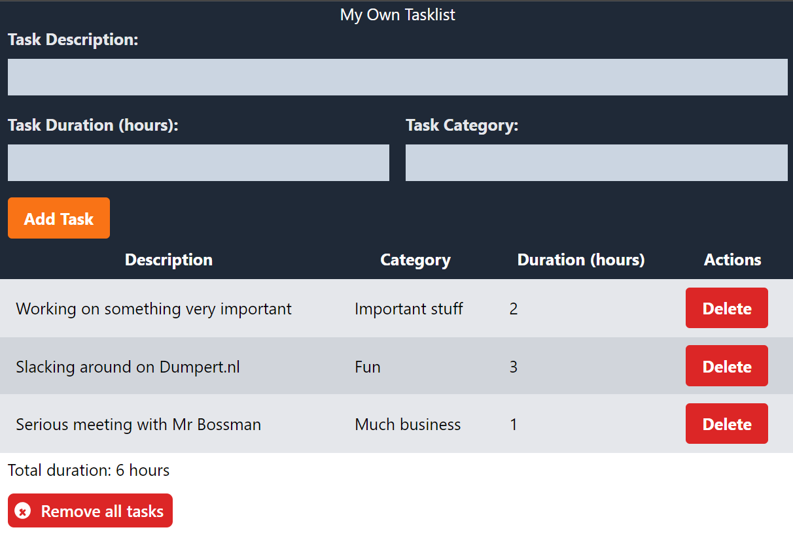

# My Tasklist

🔥 My Tasklist is a minimalistic task management web app built using Svelte. This project showcases my ability to use Svelte's reactive programming model to create dynamic and responsive user interfaces. Thank you for checking it out! 🔥

## Features

✏️ Add tasks to your list with a description, duration in hours, and category.

❌ Delete specific tasks from your list with ease.

🗑️ Delete all tasks from your list at once.

⏱️ See the total duration of all tasks on your list.

📱 Enjoy a mobile-responsive design that looks great on any device.

🌙 Protect your eyes with a stylish dark UI.

❤️ Built with Love.

